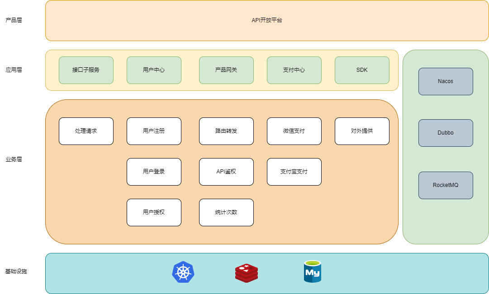

# 接口平台

## 接口平台介绍

提供一个免费的API开放平台，用户可按照给定的接口文档进行调用，开发者也可以通过本开放平台上传自己的接口，通过本项目中的智能审核功能自动审核接口并发布

## 项目地址

github: https://github.com/wzz840052918/api-service

gitee: ...

## 功能列表

* [x] 用户中心
* [x] 接口管理
* [x] 接口上传
* [x] 智能审核
* [x] 接口在线调用
* [x] 接口调用统计
* [x] 接口鉴权
* [ ] 网关限流
* [ ] 脚本一键生成SDK代码
* [ ] 聚合支付平台
* [ ] 订单列表
* [ ] 接入Es搜索引擎、Redis Search

----------------------------------------------------------------
运维侧

* [ ] 接入xxl-job、以及灰度发布实现自动流程化的SDK发布
* [ ] docker容器化部署

## 技术选型

| 说明           | 框架          |
| -------------- | ------------- |
| 基础框架       | Spring Boot   |
| 持久框架       | Mybatis-Plus  |
| 注册中心       | Nacos         |
| 远程调用       | Dubbo         |
| 程序构建       | Maven         |
| 关系型数据库   | MySQL         |
| 缓存           | Redis         |
| 消息中间件AMQP | RocketMQ      |
| 搜索引擎       | Elasticsearch |
| 数据库连接池   | Druid         |
| 定时任务       | xxl-job       |
| 负载均衡       | Nginx         |
| 日志处理       | Log4j         |

### 架构图

